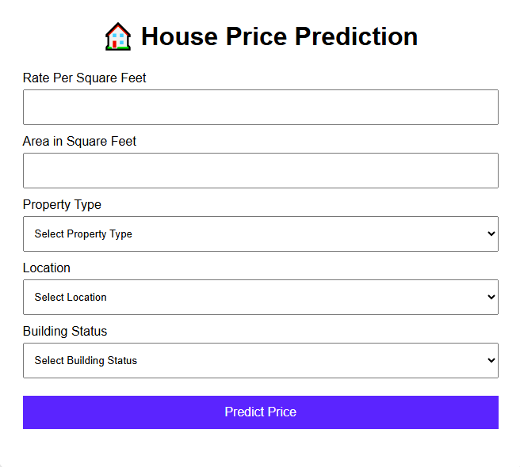

# 🚀 Hyderabad House Price Prediction



---

## 🌐 Live Demo

The model has been integrated with a Flask web application and deployed on Render for public access.

🔗 **Try the Application:**

[Click Here to Predict House Prices](https://house-price-prediction-8no5.onrender.com)

The application allows users to estimate house prices for properties located in Hyderabad by providing details such as property type, area, location, and building status.

> **Note:** This application is specifically designed for Hyderabad real estate data and supports Hyderabad locations included in the training dataset.

---

## 📌 Project Overview

This project develops an end-to-end Machine Learning project for predicting house prices in Hyderabad using real estate property data.

The workflow covers data collection, preprocessing, exploratory data analysis (EDA), feature engineering, model building, evaluation, hyperparameter tuning, and business insights generation.

The final objective is to accurately estimate property prices and identify the key factors that influence housing costs in Hyderabad.

The trained machine learning model was integrated with a Flask web application and an HTML-based user interface, allowing users to input property details and receive real-time house price predictions through a deployed web application.
---

## 🎯 Business Problem

Accurate house price estimation is important for:

* Home buyers making informed purchasing decisions.
* Property sellers determining competitive pricing.
* Real estate agencies evaluating market trends.
* Investors identifying profitable locations and property types.

This project aims to build a predictive model that can estimate property prices based on property characteristics and location-related features.

---

## 🛠️ Technologies Used

* Python
* Pandas
* NumPy
* Matplotlib
* Seaborn
* Scikit-learn
* XGBoost
* Jupyter Notebook
* joblib
* flask
* gunicorn

---

## 📊 Dataset

Dataset Used:

```text
Data/Hyderbad_House_price.csv
```

The dataset contains various property-related attributes such as:

* Property Type
* Location
* Price
* Area in sqft
* Rate per sqft
* Property Age
* Amenities
* Price

---

## 🔄 Project Workflow

```text
Load Data
    ↓
Understand Data
    ↓
Exploratory Data Analysis
    ↓
Data Cleaning
    ↓
Feature Engineering
    ↓
Train-Test Split
    ↓
Baseline Modeling
    ↓
Model Comparison
    ↓
Hyperparameter Tuning
    ↓
Final Model Selection
    ↓
Business Insights & Conclusion
```

---

## 🧪 Project Phases

### Phase 1 — Data Loading

* Load the raw dataset.
* Inspect rows, columns, and data types.

### Phase 2 — Understanding Data

* Analyze feature distributions.
* Check missing values and duplicates.
* Generate descriptive statistics.

### Phase 3 — Exploratory Data Analysis (EDA)

* Univariate Analysis.
* Bivariate Analysis.
* Correlation Analysis.
* Property price trend visualization.

### Phase 4 — Data Cleaning

* Handle missing values.
* Remove duplicates.
* Correct inconsistent data entries.

### Phase 5 — Feature Engineering

* Encode categorical variables.
* Scale numerical features where required.
* Create additional meaningful features.

### Phase 6 — Train-Test Split

* Split data into training and testing datasets.

### Phase 7 — Baseline Modeling

* Train multiple regression algorithms.

### Phase 8 — Model Comparison

* Compare performance metrics of all baseline models.

### Phase 9 — Hyperparameter Tuning

* Tune top-performing models.
* Improve prediction accuracy.

### Phase 10 — Insights & Conclusion

* Generate business insights.
* Final model selection and deployment readiness.

---

## 🤖 Machine Learning Models Used

The following regression algorithms were trained and evaluated:

| Model                                         |
| --------------------------------------------- |
| Linear Regression                             |
| Decision Tree Regressor                       |
| Random Forest Regressor                       |
| K-Nearest Neighbors (KNN) Regressor           |
| Support Vector Regressor (SVR)                |
| Extreme Gradient Boosting (XGBoost) Regressor |
| Voting Regressor                              |
| Stacking Regressor                            |

---

## 🏆 Best Performing Models

After evaluating all baseline models, the following models delivered the best performance:

* Decision Tree Regressor
* XGBoost Regressor

These models achieved the highest predictive accuracy compared to the remaining algorithms.

---

## ⚙️ Hyperparameter Tuning

Hyperparameter tuning was performed on the best-performing models:

* Decision Tree Regressor
* XGBoost Regressor

After tuning and evaluation, the **Decision Tree Regressor** was selected as the final production model due to its superior performance on the testing dataset.

---

## 🎯 Final Model

**Selected Model:**

```text
Decision Tree Regressor
```

**Saved Model Location:**

```text
Models/DecisionTree_Regressor_HousePricePrediction.pkl
```

This model can be loaded and used for future house price predictions without retraining.

---

## 📈 Key Insights

### 1. Property Type Impact

Residential plots, 2 BHK apartments, and 3 BHK apartments dominate the Hyderabad housing market.

### 2. BHK vs Price

Property prices generally increase with the number of bedrooms.

### 3. Premium Property Categories

Villas and independent houses command significantly higher prices than apartments.

### 4. Luxury Segment

Properties with 5+ BHK configurations represent the highest-priced segment of the market.

### 5. Location Influence

Property location remains one of the strongest factors affecting house prices.

---

## ✅ Conclusion

This project successfully developed a complete machine learning pipeline for Hyderabad house price prediction.

Several regression algorithms were evaluated, including Linear Regression, Decision Tree, Random Forest, KNN, SVR, XGBoost, Voting Regressor, and Stacking Regressor.

After model comparison and hyperparameter tuning, the **Decision Tree Regressor** was selected as the final model due to its strong predictive performance and generalization capability.

The trained model can be used to estimate property prices and support data-driven decision-making for buyers, sellers, investors, and real estate professionals.

---

## 👨‍💻 Author

**Vamshi Dunna**

Machine Learning | Data Analytics | Python Developer

LinkedIn: [https://www.linkedin.com/in/vamshi-dunna-7a56a8275](https://www.linkedin.com/in/vamshi-dunna-7a56a8275)

GitHub: [https://github.com/imdvamshi](https://github.com/imdvamshi)
